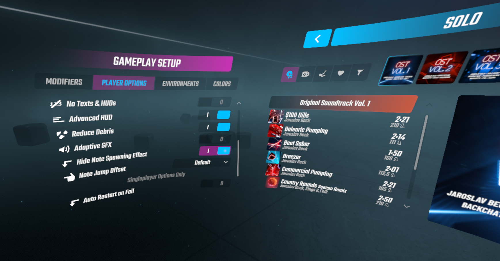

# Beat Saber NoteSpawnEffectRemover

Removes the note spawn effect (the bright light cone). That is it. Nothing else. Based on a mod idea by NepToast.

You can enable/disable the mod in the mod settings.

## Notice regarding further mod development!
As of Beat Saber 1.12.1, the option provided by this mod is now part of the base game. You can switch off the note spawn effect in the player settings (see screenshot below). Because of that, this mod won't get any more updates as long as it is part of the base game settings.

## Installation

Drop the DLL file into your plugins folder. 

## Removal

Delete the DLL file from your plugins folder.
